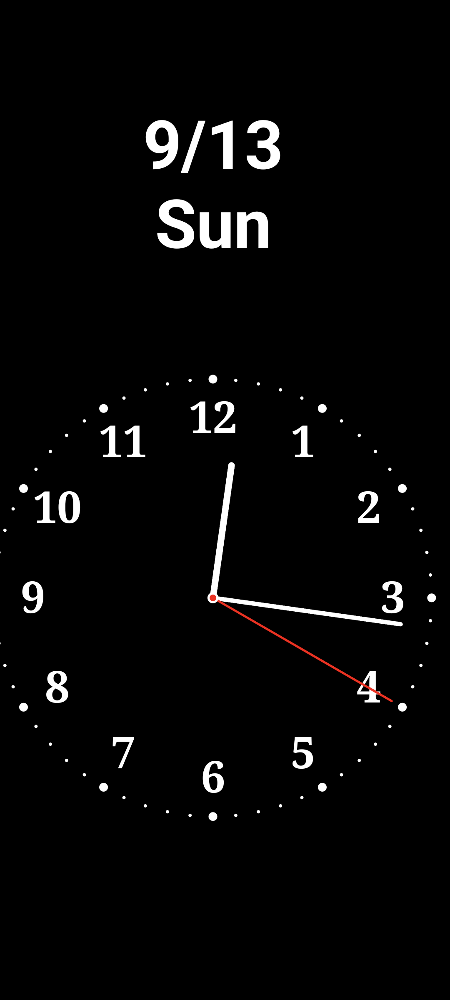

# BW_clock

<p align="center">
  
  
  
</p>
<p align="center">Screenshots from the phone version. The TV version draws the same clock face in landscape. The third image is the phone's home-screen widget, which does not exist in the TV version.<br>スマホ版のスクリーンショットです。TV 版は同じ文字盤を横画面で表示します。3 枚目はスマホ版のホーム画面ウィジェットで、TV 版にはありません。</p>

[English](#english) | [日本語](#日本語)

---

## English

A black-and-white analog clock for Android TV, designed for laser projectors. It fills a landscape screen, keeps the display on, and is meant to be projected onto a wall as an always-on clock. The high-contrast black-and-white design projects cleanly.

A phone port with a home-screen widget is available as [BW_clock_phone](https://github.com/lunelukkio/BW_clock_phone).

### Features

- Fullscreen landscape analog clock with a black or white background and a red second hand
- Screen stays on while the app is in the foreground
- Burn-in prevention: the clock face drifts slowly along a small orbit (one lap every 6 hours)
- In-app brightness (0–100%) implemented as a dark overlay, so the projector's own brightness is untouched
- Rotation in 90° steps, for projectors mounted sideways
- Toggles for the second hand, numbers, tick marks and frame
- Adjustable size, position and number font
- Optional date display (month/day and weekday) with its own position, size and offset
- All settings are changed from the TV remote and saved on the device

### Requirements

- Android TV, Android 5.0 (API 21) or later. Built against API 36.
- A touchscreen is not required. The app registers itself with the Leanback launcher, so it appears in the TV home screen.
- No network access.

### Install

The app is not on Google Play. Build the APK from source (see Build below) and sideload it to the TV, for example over the network:

```
adb connect <tv-ip-address>
adb install app/build/outputs/apk/release/app-release.apk
```

Note: the file currently checked in at `app/release/app-release.apk` was built from the phone port, not from this TV source (its package name is `com.example.bw_clock_phone` and it is a portrait app with no TV launcher entry). Build from source until that file is replaced.

### Usage

Everything is controlled with the TV remote.

| Key | On the clock | In the settings menu |
|---|---|---|
| OK (D-pad center), Enter, Menu | Open the settings menu | Same as Right for the selected item |
| Up / Down | - | Move between items |
| Left / Right | - | Change the selected value |
| Back | - | Close the settings menu |

The menu appears on the right side of the screen (at the bottom when the clock is rotated 90° or 270°). The selected row is highlighted; long lists scroll automatically.

### Settings

| Setting | Range / values |
|---|---|
| Brightness | 0–100%, 10% steps |
| Theme | Dark (black background) / Light |
| Second hand | ON / OFF |
| Numbers | ON / OFF |
| Tick marks | ON / OFF (60 dots, larger every 5 minutes) |
| Frame | ON / OFF |
| Font | Default / Serif / Monospace / Light / Bold |
| Size | 50–200%, 10% steps |
| Clock X / Y | Percent of the screen, 5% steps |
| Date | ON / OFF, shows month/day and weekday |
| Date position | Left / Right (Top / Bottom while rotated 90° or 270°) |
| Date size | 50–300%, 10% steps |
| Date X / Y | Percent of the screen, 5% steps |
| Burn-in prevention | ON / OFF |
| Rotation | 0° / 90° / 180° / 270° |
| Reset | Restores all defaults |

The settings UI is in Japanese.

### Build

Requirements: a recent Android Studio that supports Android Gradle Plugin 9.1 (the project uses AGP 9.1.1, Kotlin 2.2.10 and compileSdk 36).

```
./gradlew assembleRelease
```

The output is `app/build/outputs/apk/release/app-release.apk`.

Signing: the release build is signed with the key described in `keystore.properties` in the project root (gitignored). Create it before building a release:

```
storeFile=<path to your .jks>
storePassword=<...>
keyAlias=<...>
keyPassword=<...>
```

### Project structure

| File | Role |
|---|---|
| `MainActivity.kt` | Fullscreen host. Keeps the screen on, applies rotation, handles remote keys, opens the settings menu. |
| `ClockScreen.kt` | Compose `Canvas` drawing of the clock face, hands, date and brightness overlay. Owns the time ticker and the burn-in orbit. |
| `SettingsScreen.kt` | D-pad driven settings list. |
| `SettingsState.kt` | `ClockSettings` data class and DataStore repository. |
| `ui/theme/` | Black-and-white color set and theme. |

Tech stack: Kotlin, Jetpack Compose, Compose for TV (`androidx.tv`), DataStore Preferences.

### History

| Date | Change |
|---|---|
| 2026-04-10 | 1.0: analog clock app |
| 2026-04-20 | 1.1: clock and date position adjustment |
| 2026-05-05 | Signed release build from the command line; settings menu scrolls with `LazyColumn` |

### Related

- [BW_clock_phone](https://github.com/lunelukkio/BW_clock_phone): phone port with a home-screen widget

---

## 日本語

レーザープロジェクター向けに作った Android TV 用の白黒アナログ時計です。横画面いっぱいに時計を表示し、画面を消灯させないので、壁に投影する常時表示の時計として使えます。コントラストの高い白黒デザインなので投影してもくっきり映ります。

ホーム画面ウィジェット付きのスマートフォン版は [BW_clock_phone](https://github.com/lunelukkio/BW_clock_phone) にあります。

### 特徴

- 横画面フルスクリーンのアナログ時計。背景は黒または白、秒針は赤
- アプリ表示中は画面が消灯しない
- 焼き付き防止: 時計の位置を小さな円軌道に沿ってゆっくり移動（6 時間で 1 周）
- アプリ内の明るさ調整（0〜100%）。黒い overlay を重ねる方式で、プロジェクター本体の明るさ設定は変更しない
- 横向きに設置したプロジェクター向けに 90° 単位で回転
- 秒針、数字、目盛り、外枠の ON / OFF
- サイズ、位置、数字のフォントを調整可能
- 日付表示（月/日と曜日）。位置、サイズ、オフセットを個別に調整可能
- すべての設定はテレビのリモコンで変更し、端末に保存される

### 動作環境

- Android TV、Android 5.0（API 21）以降。API 36 でビルド
- タッチスクリーンは不要。Leanback ランチャーに登録されるので、TV のホーム画面に表示される
- ネットワークは使用しません

### インストール

Google Play では配布していません。ソースから APK をビルドし（下記「ビルド」参照）、TV へ sideload してください。ネットワーク経由の例:

```
adb connect <TV の IP アドレス>
adb install app/build/outputs/apk/release/app-release.apk
```

注意: 現在リポジトリに含まれている `app/release/app-release.apk` は、この TV 版ソースではなくスマートフォン版から作られたビルドです（パッケージ名が `com.example.bw_clock_phone` で、縦画面固定かつ TV ランチャーに表示されません）。このファイルが差し替えられるまでは、ソースからビルドしてください。

### 使い方

操作はすべてテレビのリモコンで行います。

| キー | 時計表示中 | 設定メニュー表示中 |
|---|---|---|
| 決定（十字キー中央）、Enter、Menu | 設定メニューを開く | 選択中の項目に対して「右」と同じ |
| 上 / 下 | - | 項目の移動 |
| 左 / 右 | - | 選択中の値を変更 |
| 戻る | - | 設定メニューを閉じる |

メニューは画面右側に表示されます（時計を 90° または 270° 回転しているときは画面下側）。選択中の行は強調表示され、項目が多い場合は自動でスクロールします。

### 設定項目

| 項目 | 範囲 / 値 |
|---|---|
| 明るさ | 0〜100%、10% 刻み |
| テーマ | 黒背景 / 白背景 |
| 秒針 | ON / OFF |
| 数字 | ON / OFF |
| 目盛り | ON / OFF（60 個のドット。5 分ごとに大きいドット） |
| 外枠 | ON / OFF |
| フォント | デフォルト / セリフ / 等幅 / 細字 / 太字 |
| サイズ | 50〜200%、10% 刻み |
| 時計 横位置 / 縦位置 | 画面に対する割合、5% 刻み |
| 日付 | ON / OFF。月/日と曜日を表示 |
| 日付位置 | 左 / 右（90° または 270° 回転中は 上 / 下） |
| 日付サイズ | 50〜300%、10% 刻み |
| 日付 横位置 / 縦位置 | 画面に対する割合、5% 刻み |
| 焼付防止 | ON / OFF |
| 回転 | 0° / 90° / 180° / 270° |
| リセット | すべて初期状態に戻す |

設定画面の表示は日本語です。

### ビルド

必要なもの: Android Gradle Plugin 9.1 に対応した最近の Android Studio（本プロジェクトは AGP 9.1.1、Kotlin 2.2.10、compileSdk 36 を使用）

```
./gradlew assembleRelease
```

出力先は `app/build/outputs/apk/release/app-release.apk` です。

署名: release ビルドは、プロジェクトルートの `keystore.properties`（gitignore 済み）に記述した鍵で署名されます。release をビルドする前に作成してください。

```
storeFile=<.jks ファイルのパス>
storePassword=<...>
keyAlias=<...>
keyPassword=<...>
```

### 構成

| ファイル | 役割 |
|---|---|
| `MainActivity.kt` | フルスクリーンのホスト。画面を消灯させない設定、回転の適用、リモコンキーの処理、設定メニューの表示 |
| `ClockScreen.kt` | Compose の `Canvas` で文字盤、針、日付、明るさ overlay を描画。時刻の更新と焼付防止の軌道を管理 |
| `SettingsScreen.kt` | 十字キーで操作する設定リスト |
| `SettingsState.kt` | `ClockSettings` データクラスと DataStore リポジトリ |
| `ui/theme/` | 白黒のカラーセットとテーマ |

技術スタック: Kotlin、Jetpack Compose、Compose for TV（`androidx.tv`）、DataStore Preferences

### 履歴

| 日付 | 変更 |
|---|---|
| 2026-04-10 | 1.0: アナログ時計アプリ |
| 2026-04-20 | 1.1: 時計と日付の位置調整機能を追加 |
| 2026-05-05 | コマンドラインから署名済み release をビルドできるよう設定。設定メニューのスクロールを `LazyColumn` に変更 |

### 関連

- [BW_clock_phone](https://github.com/lunelukkio/BW_clock_phone): ホーム画面ウィジェット付きのスマートフォン版
